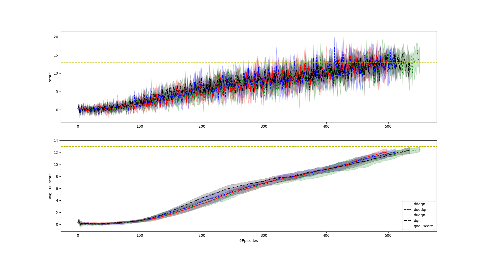
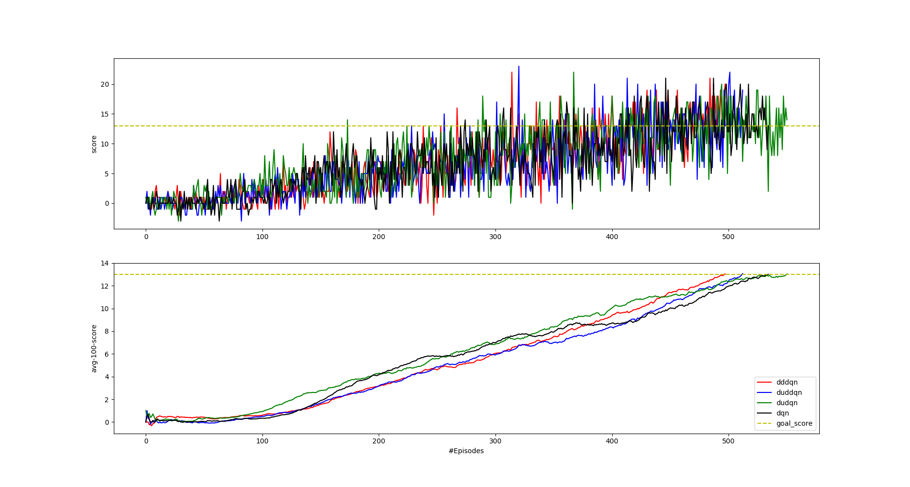
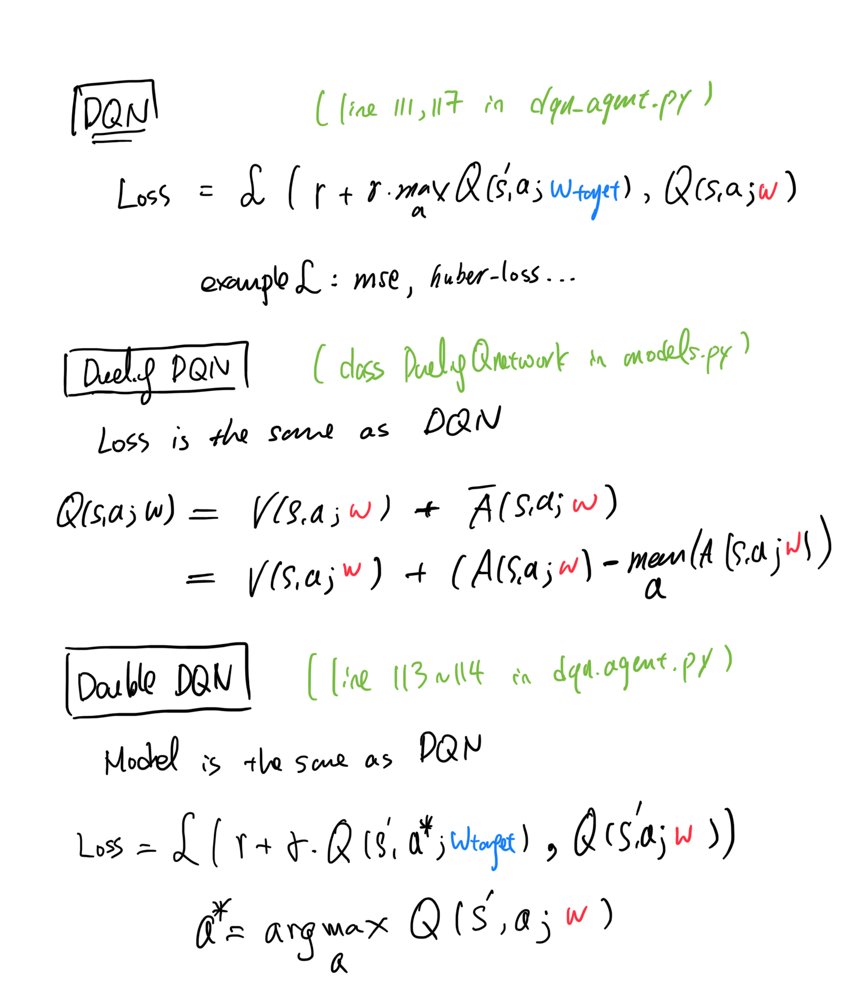

### **Algorithms**
In this project, I implement three **deep Q-network (DQN)** based agents and demonstrate their abilty to sucessfully learn how to navigate and collect bananas in a 3D environment from scratch [(see introduction of the Environment)](./README.md). The most important feature of DQN is that it extends the classical tabular Q-learning agent to work in high-dimension state space using neural network approximation where advanced deep learning models such as CNN, RNN can easily come into play. However, the idea is not working straightforward since using neural network models introduces additional complication. Technically, two main tricks are proposed to make DQN trainable: **fitted Q-target** and **experience replay**. 

When using neural network approximation, Q-learning will be translated from direct value update into parameter tuning. The fitting here is to minimize the difference between bootstrap value and the current value such that the Q-network satisfies Bellman equation. It is essentially a supervised learning problem but both targets and predictions are being tuned. Such objectives might not be learnable in that it is totally possible to end up at bad soutions, for example, setting both networks to be exactly zero. To solve this problem, **fitted Q-target** was proposed to use a fixed target network (and update it periodiclly) to evaluate the bootstraped values, serving as the learning targets. Such approach works well in practice despite that it introduces another source of bias. 

**Experience replay** is another trick that mitigates data-hunger and correlated data problems in RL. A replay buffer is constructed to store the most recent N experiences, which will then be sampled ocassionally to train the Q-network. Off-policy characteristic of Q-learning algorithm enables it to learn from old experiences in the buffer.

I also include two variants of DQN. First, **Double DQN** uses the actions of the local Q-network to determine the boostrap value in the target Q-network and is shown to reduce overestimation problem of Q values in DQN. Second, **Dueling DQN** represents state-value $V(s)$ and the advantage $A(s,a)$ separately in the network architecutre. Accurate estimation for the two would result in better overall performance.

### **Implementation**
All model mentioned in the Algorithm section are included in this project. Plus, a hybrid model of **Double DQN** and **Duel DQN**. The two can be combined directly without conflict since they are tweaking different perspectives. **Double DQN** is for the learning target whereas **Dueling DQN** is for the model architecture. 

For details of the implementation, **Appendix 1** summarizes the key equations and corresponding line of codes in the projects.

Hyperparameter in the project is fixed throughout the project. The choices are summarized in **Appendx 2**.

### **Results**  
I have examined the four models: **Deep Q-Network (dqn), Double DQN (dddqn), Dueling DQN (dudqn) and Double Dueling DQN (duddqn)**. Each of them is trained for five independent runs with different random seeds.

#### **Statistics**
**Figure 1: Average training progress over the five runs with condifendence (+- 1 standard deviation)**

**Figure-2: Best agents (shortest learning time) among the five runs**

**Discussion**
- The task can be solved in around 400 episodes, which is about 500 seconds in wall time.   
- Training traces did not vary much over runs (low standard deviation). This indicates that the agent can solve the task confidently. 
- Our fatest learning agent is **Double DQN** (Figure-2). On average, **Double DQN** also learn a bit faster than others but not significantly.
- However, in terms of performance, no dicernable difference among all DQN variants. The training traces are highly overlapped. One suspected reason is that the task is too small and easy for showing the specialty of each model. Therefore, a direct future work is to observe their effects in the raw pixel environment.

**Video recording of a trained agent**
- An example trained **Double DQN** agent is available: [Link](./results/animation/dddqn-demo.mp4)

### **Future Work**
I list some possible future directions to enhance the current work:

- Adopt and test two possible additional modules: auxiliary tasks (e.g. reward prediction, state prediction) and recurrent networks. 
- Implement RAINBOW agent
- Work on hyperparameter optimization to get possible better results. 
- Work on the challenge task (learning from pixel) with convolutional agents
- Benchmark the task together with other RL approaches (policy-based, ES, AC-based, DDPG etc.)

### **Reference**
Research Papers:
- [Deep-Q Network 2015](https://www.nature.com/articles/nature14236)
- [Dueling DQN 2016](https://arxiv.org/abs/1511.06581)
- [Double DQN 2016](https://arxiv.org/abs/1509.06461)

Related Projects:
- dalmia
- danielabarbosa
- yingweiyu

Useful Links:- [OpenAI Spinningup](https://spinningup.openai.com/en/latest/index.html)- [Markdown Cheatsheet (for making reports)]()

### **Appendix**
1. Key equations and the corresponding lines of codes in the project are summarized in  
2. Hyperparameters

| Hyperparameter                      | Value |
| ----------------------------------- | ----- |
| Agent Model Type                    | MLP   |
| Agent Model Arch                    | [in, 20, 20, out] |
| Update (Learning) Frequency         | every 4 steps |
| Replay buffer size                  | 1e5   |
| Batch size                          | 64    |
| $\gamma$ (discount factor)          | 0.99  |
| Optimizer                           | Adam  |
| Learning rate                       | 5e-4  |
| Soft-Update (*1)                      | True  |
| $\tau$ (soft-update mixing rate)    | 1e-3  |
| $\epsilon$ (exploration rate) start | 1.0   |
| $\epsilon$ minimum                  | 0.1   |
| $\epsilon$ decay                    | 0.995 |

(*1.) Soft-update is a way to update the target network by mixing the current local parameters and current target parameters one via the following formula:

$w_{target} \leftarrow \tau * w_{local} + (1-\tau) * w_{target}$

The original DQN uses hard-update (i.e. $\tau=1$), meaning that the target network is fully updated by the current local network. In practice, hard-update needs to be updated less frequently since it requires the local network to first accumulate more knowledge. The choice of hard-update is exposed in the project, and one can experiment with it by setting soft-update to be False.

 